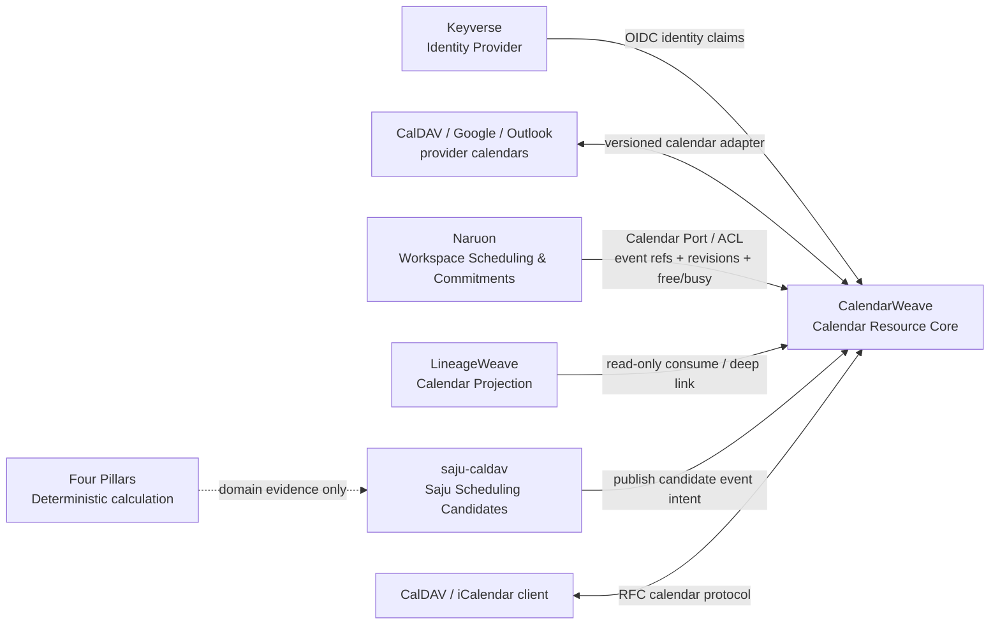

# CalendarWeave architecture

## Maturity

This document defines the accepted target boundary for CalendarWeave. Protected `main` is still a seed repository and does **not** yet implement the CalDAV/iCalendar PIMS described here. Until CalendarWeave has a versioned production contract and parity evidence, existing consumer-side calendar implementations remain compatibility paths rather than evidence that CalendarWeave is already the system of record.

The ADR-0002 candidate adds only an executable Rust application port and
in-memory conformance adapter for collection plus strict VEVENT create/list/get.
It does not change the protected-main, durability, CalDAV, deployment, or
consumer-migration evidence boundary above.

## Product responsibility

CalendarWeave is the reusable calendar bounded context for ContextualWisdomLab. It owns generic calendar-resource semantics and calendar interoperability, not the business reason an event exists.

CalendarWeave owns:

- calendar collections, calendar resources, event identity and revisions;
- RFC 5545 iCalendar parsing/serialization and recurrence/timezone semantics;
- RFC 4791 CalDAV collection/query/access behavior;
- scheduling/synchronization protocol behavior when implemented, including capability discovery, ETag/scheduling-tag preconditions, sync tokens, free/busy and iTIP/CalDAV scheduling contracts;
- provider adapters for calendar systems such as CalDAV servers, Google Calendar or Outlook when those adapters become supported;
- tenant/purpose-scoped calendar authorization, audit evidence, provider mapping and calendar sync receipts;
- standalone PIMS APIs plus a versioned package/API/event surface for other CWL products.

CalendarWeave does **not** own mail/threading, project/task semantics, Naruon commitment/conflict policy, LineageWeave lineage/ontology, Four Pillars calculation, saju candidate scoring, identity-provider behavior, or GRC policy.

## Context Map

### CalendarWeave ↔ Naruon

Naruon owns the *meaning of a commitment inside a workspace*: confirmed/tentative/desired policy, conflict assessment, private-context bridge, project/task/mail evidence, recommendation, approval/correction workflow and buyer-facing explanation. CalendarWeave owns the authoritative generic calendar objects and provider synchronization mechanics.

Naruon may retain immutable evidence snapshots needed to explain a past decision, but those snapshots are evidence, not a second authoritative calendar graph. Long-term Naruon code must not own Google Calendar SDK details, generic CalDAV synchronization, generic VEVENT/VTODO serialization, provider ETag/sync-token machinery or calendar collection persistence when the equivalent released CalendarWeave contract exists. Integration must use a versioned Naruon `CalendarPort`/Anti-Corruption Layer rather than CalendarWeave database access or DTO leakage.

### CalendarWeave ↔ LineageWeave

LineageWeave consumes calendar information or deep-links into CalendarWeave for lineage/evidence workflows. It does not persist an authoritative calendar store and does not absorb CalendarWeave into LineageWeave #74 or another ontology aggregate.

### CalendarWeave ↔ saju-caldav

`saju-caldav` owns birth/profile inputs, cultural/astronomical calculation choices that belong to that product, pair/time candidate rules, candidate scoring/explanation, and the decision to request publication of selected candidate times. CalendarWeave owns generic calendar publication, collections, iCalendar/CalDAV protocol state and provider synchronization.

The current `saju-caldav` Radicale/CalDAV stack predates a production-ready CalendarWeave contract. It remains a compatibility implementation until CalendarWeave can prove equivalent create/list/get/update/delete, recurrence/timezone, privacy classification, idempotency, authorization and failure behavior. After parity, the generic Radicale/CalDAV responsibility should move behind a CalendarWeave adapter and be removed from `saju-caldav`; saju-specific event content policy remains in `saju-caldav`.

### CalendarWeave ↔ Four Pillars

CalendarWeave does not interpret or calculate Four Pillars. `four-pillars` remains the deterministic calculation/report product. If `saju-caldav` can reuse a published Four Pillars calculation contract without changing its product semantics, that reuse belongs between those two products; it must not be implemented inside CalendarWeave.

## Ownership matrix

| Concern | Authoritative owner | Consumers / notes |
| --- | --- | --- |
| Calendar collection/event resource and revision | CalendarWeave | Naruon, LineageWeave, saju-caldav, external clients |
| iCalendar / CalDAV protocol semantics | CalendarWeave | Consumer products use ports/adapters |
| Provider calendar sync and revision receipts | CalendarWeave | Consumer-specific authorization intent remains with consumer |
| Workspace commitment/conflict decision | Naruon | References CalendarWeave event/resource evidence |
| Mail/thread evidence | Naruon + ThreadWeave boundary | CalendarWeave receives no mail authority |
| Lineage/ontology interpretation | LineageWeave | Calendar references only |
| Saju candidate selection/explanation | saju-caldav | Publishes selected intents to CalendarWeave |
| Four Pillars deterministic calculation/report | four-pillars | Not a CalendarWeave responsibility |
| Identity and federation | Keyverse | CalendarWeave validates scoped identity; no local IdP |

## Migration invariant

Do not delete a working consumer implementation merely because this target boundary exists. Migration is ordered:

1. CalendarWeave publishes a versioned executable contract with real RFC fixtures and 100% owned production statement/branch coverage.
2. Each consumer first adds characterization/contract tests for its current behavior.
3. The consumer introduces a narrow CalendarWeave port/ACL and proves parity, failure semantics and tenant/privacy boundaries.
4. Provider-specific/generic calendar code is removed from the consumer only after the released CalendarWeave path is production-equivalent.
5. Architectural fitness tests prevent the duplicated generic calendar responsibility from returning.

No consumer may read CalendarWeave application tables directly.

## Target logical data model

The following is a target logical model, **not a claim that protected `main` already persists these tables**:

- `calendar_collections`: collection identity, display name, timezone, owner scope.
- `calendar_events`: UID, collection FK, temporal definition, revision/etag and canonical event payload reference.
- `event_attendees`: event FK, participant address/reference, participation role/status.
- `provider_event_mappings`: CalendarWeave event FK, provider identity, opaque provider resource identity and current revision evidence.
- `calendar_sync_cursors`: collection/provider scope, sync token/cursor and recorded time.

No repeating groups. Provider DTOs and credentials do not become domain entities.

## Trust

Fail closed without purpose-limited identity and authorization. Consume Keyverse; do not stand up a local IdP. Necessary attendee/organizer data remains usable under least privilege, tenant/purpose isolation, encryption, retention and access/export audit rather than blanket masking. Provider credentials and raw Authorization data are never domain attributes or ordinary telemetry.

## Citations

Daboo, C., Desruisseaux, B., & Dusseault, L. M. (2007). *Calendaring extensions to WebDAV (CalDAV)* (RFC 4791). RFC Editor. https://doi.org/10.17487/RFC4791

Desruisseaux, B. (2009). *Internet calendaring and scheduling core object specification (iCalendar)* (RFC 5545). RFC Editor. https://doi.org/10.17487/RFC5545

Daboo, C. (2010). *iCalendar transport-independent interoperability protocol (iTIP)* (RFC 5546). RFC Editor. https://doi.org/10.17487/RFC5546

Daboo, C., & Quillaud, A. (2012). *Collection synchronization for WebDAV* (RFC 6578). RFC Editor. https://doi.org/10.17487/RFC6578

Daboo, C., & Desruisseaux, B. (2012). *Scheduling extensions to CalDAV* (RFC 6638). RFC Editor. https://doi.org/10.17487/RFC6638
