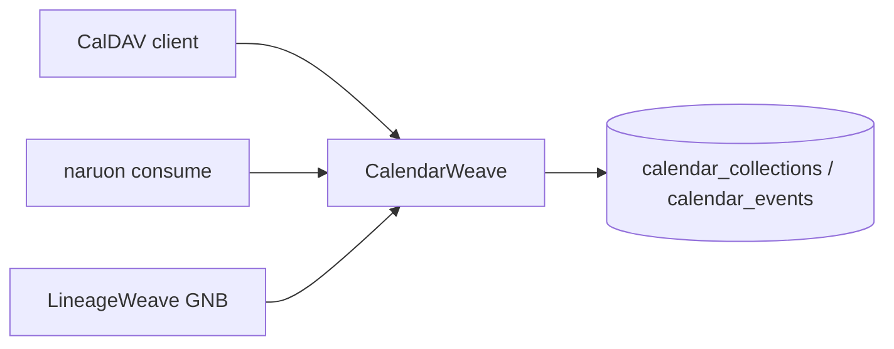

# CalendarWeave architecture

## Boundary

CalendarWeave is the only Officeware calendar product. Consumers (naruon mail, LineageWeave GNB “달력”, Outlook) call CalDAV. They must not store a second calendar graph.

## Core ERD (3NF)

- `calendar_collections`: collection identity, display name, timezone name, owner subject.
- `calendar_events`: UID, collection FK, summary, description, dtstart, dtend, etag, raw ics.
- `event_attendees`: event FK, attendee address, participation role, participation status.

No repeating groups. Attendees are not denormalized onto `calendar_events`.

## Trust

Fail closed without a purpose-limited bearer. Consume Keyverse; do not stand up a local IdP. CSAP / ISMS / SOC 2 controls live as product access+audit, not as PII masks.

## Citations

Internet Engineering Task Force. (2009). *Internet Calendaring and Scheduling Core Object Specification (iCalendar)* (RFC 5545). https://doi.org/10.17487/RFC5545

Internet Engineering Task Force. (2007). *Calendaring Extensions to WebDAV (CalDAV)* (RFC 4791). https://doi.org/10.17487/RFC4791
