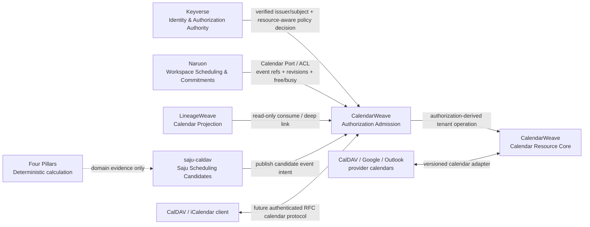

# CalendarWeave architecture

## Maturity

This document defines the accepted target boundary for CalendarWeave. Protected `main` is still a seed repository and does **not** yet implement the CalDAV/iCalendar PIMS described here. Until CalendarWeave has a versioned production contract and parity evidence, existing consumer-side calendar implementations remain compatibility paths rather than evidence that CalendarWeave is already the system of record.

The ADR-0002 candidate adds an executable Rust application port and in-memory
conformance adapter for collection plus strict VEVENT
create/conditional-update/list/get. The stacked ADR-0003 candidate adds a 3NF
PostgreSQL store with durable identity, append-only revisions, and row-locked
ETag updates. The stacked ADR-0004 candidate adds bounded IANA TZID interval
validation through the shared parser. ADR-0005 adds a fail-closed application
admission ACL around the Calendar Resource Core: it consumes externally verified
issuer/subject evidence with no caller-selected tenant, presents the exact action
and resource references to an external authorization port, and uses only the
authorization-derived tenant when delegating to the core. Authorization precedes
calendar parsing. The stacked ADR-0006 candidate adds a PostgreSQL logical
backup/restore operation with private artifacts, checksum-before-restore and an
executable invariant recovery drill. ADR-0007 adds the next bounded RFC 5545
interoperability slice: positive `DURATION` values become an alternative to
`DTEND` while remaining mutually exclusive, DATE starts accept only day/week
durations, and the same UTC/IANA start validator is reused by both persistence
adapters. These remain candidate evidence rather than protected-main or
released-product evidence; ADR-0006 specifically does not claim an operated
RPO/RTO, WAL/PITR, HA/failover, service authentication, CalDAV deployment, or
consumer migration, and ADR-0007 does not claim `VTIMEZONE`, recurrence,
floating-time, free/busy expansion, or full RFC 5545 conformance.

## Product responsibility

CalendarWeave is the reusable calendar bounded context for ContextualWisdomLab. It owns generic calendar-resource semantics and calendar interoperability, not the business reason an event exists.

CalendarWeave owns:

- calendar collections, calendar resources, event identity and revisions;
- RFC 5545 iCalendar parsing/serialization and recurrence/timezone semantics;
- RFC 4791 CalDAV collection/query/access behavior;
- scheduling/synchronization protocol behavior when implemented, including capability discovery, ETag/scheduling-tag preconditions, sync tokens, free/busy and iTIP/CalDAV scheduling contracts;
- provider adapters for calendar systems such as CalDAV servers, Google Calendar or Outlook when those adapters become supported;
- calendar-resource authorization admission, audit evidence, provider mapping and calendar sync receipts, while identity/token verification and organization authorization policy stay in their owning control planes;
- standalone PIMS APIs plus a versioned package/API/event surface for other CWL products.

CalendarWeave does **not** own mail/threading, project/task semantics, Naruon commitment/conflict policy, LineageWeave lineage/ontology, Four Pillars calculation, saju candidate scoring, identity-provider behavior, token verification, or GRC policy.

## Context Map

The Calendar Resource Core is the core subdomain. Authorization Admission and provider/CalDAV interoperability are supporting application/integration subdomains. Identity/federation, database engine, telemetry and deployment platform are generic/external capabilities. The admission ACL prevents foreign identity/policy representations from becoming Calendar Resource entities or widening collection/event transaction boundaries.

### CalendarWeave ↔ Keyverse

Keyverse is the external identity/federation and authorization-control-plane owner. CalendarWeave accepts no raw bearer-token authority merely because token bytes exist. A future infrastructure adapter must verify the applicable Keyverse issuer/token/session contract, construct tenant-free `ExternalIdentity`, evaluate the exact `CalendarAuthorizationRequest`, and return the admitted `TenantId` before `AuthorizedCalendarService` invokes the Calendar Resource Core. Callers never supply tenant scope through the admission service.

The principal key is issuer plus subject; subject text alone is not treated as globally unique. CalendarWeave keeps issuer/subject opaque and does not copy Keyverse user, credential, session or policy tables. `CalendarAuthorizationPort` is the Anti-Corruption Layer for policy decisions; provider-specific claims or DTOs terminate at that boundary. The request includes the exact opaque collection/event references needed for resource-scoped authorization without exposing CalendarWeave persistence.

### CalendarWeave ↔ Naruon

Naruon owns the *meaning of a commitment inside a workspace*: confirmed/tentative/desired policy, conflict assessment, private-context bridge, project/task/mail evidence, recommendation, approval/correction workflow and buyer-facing explanation. CalendarWeave owns the authoritative generic calendar objects and provider synchronization mechanics.

Naruon may retain immutable evidence snapshots needed to explain a past decision, but those snapshots are evidence, not a second authoritative calendar graph. Long-term Naruon code must not own Google Calendar SDK details, generic CalDAV synchronization, generic VEVENT/VTODO serialization, provider ETag/sync-token machinery or calendar collection persistence when the equivalent released CalendarWeave contract exists. Integration must use a versioned Naruon `CalendarPort`/Anti-Corruption Layer rather than CalendarWeave database access or DTO leakage.

### CalendarWeave ↔ LineageWeave

LineageWeave consumes calendar information or deep-links into CalendarWeave for lineage/evidence workflows. It does not persist an authoritative calendar store and does not absorb CalendarWeave into LineageWeave #74 or another ontology aggregate. Mathematical or psychometric computation remains outside LineageWeave and CalendarWeave in its dedicated mathematical owner.

### CalendarWeave ↔ saju-caldav

`saju-caldav` owns birth/profile inputs, cultural/astronomical calculation choices that belong to that product, pair/time candidate rules, candidate scoring/explanation, and the decision to request publication of selected candidate times. CalendarWeave owns generic calendar publication, collections, iCalendar/CalDAV protocol state and provider synchronization.

The current `saju-caldav` Radicale/CalDAV stack predates a production-ready CalendarWeave contract. It remains a compatibility implementation until CalendarWeave can prove equivalent create/list/get/update/delete, recurrence/timezone, privacy classification, idempotency, authorization and failure behavior. After parity, the generic Radicale/CalDAV responsibility should move behind a CalendarWeave adapter and be removed from `saju-caldav`; saju-specific event content policy remains in `saju-caldav`.

### CalendarWeave ↔ Four Pillars

CalendarWeave does not interpret or calculate Four Pillars. `four-pillars` remains the deterministic calculation/report product. If `saju-caldav` can reuse a published Four Pillars calculation contract without changing its product semantics, that reuse belongs between those two products; it must not be implemented inside CalendarWeave.

## Ownership matrix

| Concern | Authoritative owner | Consumers / notes |
| --- | --- | --- |
| Calendar collection/event resource and revision | CalendarWeave | Naruon, LineageWeave, saju-caldav, external clients |
| Calendar operation admission | CalendarWeave | Tenant-free external identity + resource-aware typed request; authorization authority derives tenant; no token verifier or local policy store |
| Identity, federation and external authorization policy | Keyverse | CalendarWeave consumes verified issuer/subject identity and resource-aware policy decisions through an ACL |
| iCalendar / CalDAV protocol semantics | CalendarWeave | Consumer products use ports/adapters; candidate supports explicit `DTEND` and positive RFC 5545 `DURATION` interval forms |
| Provider calendar sync and revision receipts | CalendarWeave | Consumer-specific authorization intent remains with consumer |
| PostgreSQL logical recovery operation | CalendarWeave | ADR-0006 / PR #7 candidate proves digest-verified logical restore; deployment owns backup store, keys, cadence, RPO/RTO and WAL/PITR/HA |
| Workspace commitment/conflict decision | Naruon | References CalendarWeave event/resource evidence |
| Mail/thread evidence | Naruon + ThreadWeave boundary | CalendarWeave receives no mail authority |
| Lineage/ontology interpretation | LineageWeave | Calendar references only |
| Saju candidate selection/explanation | saju-caldav | Publishes selected intents to CalendarWeave |
| Four Pillars deterministic calculation/report | four-pillars | Not a CalendarWeave responsibility |

## Aggregate and invariant boundaries

- `CalendarCollection` is the collection identity boundary and owns membership of event resources in one tenant scope.
- `CalendarEvent` represents the current read projection of an immutable-UID event resource; revision transitions remain conditional on the current strong ETag.
- A CalendarWeave v1 VEVENT carries exactly one explicit interval form: `DTEND` or positive RFC 5545 `DURATION`. DATE-valued starts permit only day/week durations. Duration remains part of the validated source payload rather than a second persisted aggregate or guessed fixed-second end timestamp.
- `TenantId` and `ExternalIdentity` are value objects. `ExternalIdentity` has no tenant authority and never becomes a persisted calendar aggregate merely because admission used it.
- `CalendarAuthorizationRequest` is a request value carrying only action and opaque target references required by authorization; it is not persisted as a calendar aggregate.
- `AuthorizedCalendarService` is an application/domain-facing service, not an aggregate. It obtains authorization before domain processing and delegates one item-level operation at a time using only the returned tenant.
- `CalendarAuthorizationPort` and future provider adapters are repositories/ports only in the DDD integration sense; they do not grant direct access to CalendarWeave relational tables.
- Event create idempotency is collection + RFC UID; updates preserve immutable UID and advance one revision only under the expected ETag.
- A denied or unavailable authorization decision cannot become parser, storage or mutation authority.
- A caller-provided tenant string cannot become authorization authority; the tenant used by the core is derived by the trusted authorization decision for the exact request.
- Backup/restore tooling is an operations boundary outside ordinary aggregate transactions. Restore verifies artifact integrity before opening one dedicated recovery transaction and then proves the same relational invariants rather than redefining them.

## Migration invariant

Do not delete a working consumer implementation merely because this target boundary exists. Migration is ordered:

1. CalendarWeave publishes a versioned executable contract with real RFC fixtures and 100% owned production statement/branch coverage.
2. Each consumer first adds characterization/contract tests for its current behavior.
3. The consumer introduces a narrow CalendarWeave port/ACL and proves parity, failure semantics and tenant/privacy boundaries.
4. Provider-specific/generic calendar code is removed from the consumer only after the released CalendarWeave path is production-equivalent.
5. Architectural fitness tests prevent the duplicated generic calendar responsibility from returning.

No consumer may read CalendarWeave application tables directly.

## Target logical data model

The following is a target logical model, **not a claim that protected `main` already persists these tables**:

- `calendar_collections`: collection identity, display name, timezone, owner scope.
- `calendar_events`: UID, collection FK, temporal definition, revision/etag and canonical event payload reference.
- `event_attendees`: event FK, participant address/reference, participation role/status.
- `provider_event_mappings`: CalendarWeave event FK, provider identity, opaque provider resource identity and current revision evidence.
- `calendar_sync_cursors`: collection/provider scope, sync token/cursor and recorded time.

The executable PostgreSQL candidate uses the singular multiword equivalents `calendar_collection`, `calendar_event` and `calendar_event_revision`; any eventual schema-name consolidation must preserve migration compatibility rather than silently renaming released persistence. No repeating groups. Provider DTOs and credentials do not become domain entities. Any future authorization-decision persistence requires its own descriptive multiword object and retention/access contract rather than adding a generic one-word `id` table.

## Trust

Fail closed without purpose-limited identity and authorization. Consume Keyverse through an infrastructure ACL; do not stand up a local IdP or treat an arbitrary tenant string as proof of permission. `ExternalIdentity` carries only verified issuer/subject evidence. The authorization adapter evaluates the exact action/resource request and derives the tenant used by the core. Authorization precedes parsing and mutation at the application boundary. Necessary attendee/organizer data remains usable under least privilege, tenant/purpose isolation, encryption, retention and access/export audit rather than blanket masking. Provider credentials, raw Authorization data and bearer tokens are never domain attributes or ordinary telemetry.

Calendar backup artifacts can contain the same necessary calendar PII. ADR-0006 therefore protects logical backup artifacts with owner-only file permissions and verifies their digest before restore; it does not mask data in a way that would make recovery unusable. Production storage encryption, access policy, retention, key management and remote durability remain explicit deployment gates.

The current ADR-0005 candidate proves only an in-process admission contract. HTTP/service authentication, token verification, durable authorization/audit evidence, rate limiting, production Keyverse integration, CSAP/SOC 2 operational evidence, and released interoperability remain open. ADR-0006 similarly proves only a bounded logical recovery operation, not PITR, HA or an operated disaster-recovery objective. ADR-0007 validates and preserves duration semantics only; it does not compute free/busy or recurrence end instants and therefore does not create a DST or scheduling-policy claim beyond the RFC-backed input profile.

## Citations

Daboo, C., Desruisseaux, B., & Dusseault, L. M. (2007). *Calendaring extensions to WebDAV (CalDAV)* (RFC 4791). RFC Editor. https://doi.org/10.17487/RFC4791

Desruisseaux, B. (2009). *Internet calendaring and scheduling core object specification (iCalendar)* (RFC 5545). RFC Editor. https://doi.org/10.17487/RFC5545

Daboo, C. (2010). *iCalendar transport-independent interoperability protocol (iTIP)* (RFC 5546). RFC Editor. https://doi.org/10.17487/RFC5546

Daboo, C., & Quillaud, A. (2012). *Collection synchronization for WebDAV* (RFC 6578). RFC Editor. https://doi.org/10.17487/RFC6578

Daboo, C., & Desruisseaux, B. (2012). *Scheduling extensions to CalDAV* (RFC 6638). RFC Editor. https://doi.org/10.17487/RFC6638

Jones, M., Bradley, J., & Sakimura, N. (2015). *JSON Web Token (JWT)* (RFC 7519). RFC Editor. https://doi.org/10.17487/RFC7519

OpenID Foundation. (2014). *OpenID Connect Core 1.0 incorporating errata set 2*. https://openid.net/specs/openid-connect-core-1_0.html
